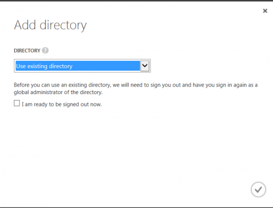

# Moodle Plugins for Microsoft Services
*including* **Office 365** *and other Microsoft services*

## Microsoft Skype Web block

This plugin provides easy access to all Microsoft Account and Office 365 services for Moodle.

This is part of the suite of Office 365 plugins for Moodle.

This repository is updated with stable releases. To follow active development, see: https://github.com/Microsoft/o365-moodle

## Installation

1. Unpack the plugin into /blocks/skypeweb within your Moodle install.
2. From the Moodle Administration block, expand Site Administration and click "Notifications".
3. Follow the on-screen instructions to install the plugin.
4. Add the block to any page you want it displayed.

For more documentation, visit https://docs.moodle.org/34/en/Office365

For more information including support and instructions on how to contribute, please see: https://github.com/Microsoft/o365-moodle/blob/master/README.md

## Configuration

### Prepare your Office 365 account for single sign-on with your Moodle installation

You will need an Azure subscription. If you do not have one, you can create one by visiting [http://azure.microsoft.com/en-us/pricing/free-trial/ Microsoft Azure Sign Up](http://azure.microsoft.com/en-us/pricing/free-trial/ Microsoft Azure Sign Up "wikilink")

To use Moodle with Office 365 for SSO, you must [configure Microsoft Azure](https://portal.azure.com) to manage your Office 365 Microsoft Azure Active Directory:

1.  Create a new Active Directory.
2.  Select Use existing directory.

3.  Select **I am ready to be signed out now** and click the check mark.

4.  Sign in with your Office 365 subscription credentials.
5.  Click **Continue**.
6.  Log out and sign back in to your Azure account.

**Note**: In order to sign-up for an Azure subscription, you are required to enter a credit card and phone number. If only use the subscription to access the Azure Active Directory associated with your Office 365 subscription and enable no other paid services such as Virtual Machines, you will not be charged for the subscription.

### Register your Moodle instance as an Application in Azure Active Directory

1.  Sign in to the [Microsoft Azure Management Portal](https://portal.azure.com).
2.  Click on the **Active Directory** icon on the left menu, and then click on the desired Office 365 connected Azure AD.
3.  On the top menu, click **Applications**. If no apps have been added to your directory, this page will only show the **Add an App** link. Click on the link, or alternatively you can click on the **Add** button on the command bar.
4.  On the **What do you want to do** page, click on the link to **Add an application my organization is developing**.
5.  On the **Tell us about your application** page, you must specify a name for your application and indicate the type of application you are registering with Azure AD. Click **web application and/or web API** (default) and then click the arrow icon on the bottom-right corner of the page.
6.  On the App properties page, provide the **Sign-on URL** and **App ID URI** for your Moodle instance.
    1.  The Sign-on URI is the main URI of the Moodle instance + '/blocks/skypeweb/skypeloginreturn.php'.
    2.  The APP ID URI is the main URI of the Moodle instance.

7.  Click the checkbox in the bottom-right hand corner of the page and then click Ok to add your app to Azure Active Directory.
8.  There are a couple more values and changes you need to make and write down some values which you will need in the next section.

### Configure your Azure Active Directory Application

1.  In Azure, click on the **Active Directory** icon on the left menu, and then click on the desired Azure AD.
2.  Click the Applications tab at the top of the screen.
3.  Locate the application you created and click it's name in the list.
4.  Click Configure at the top of the screen.
5.  Locate the **Client ID**, note this value (write it down or copy it somewhere), and set it aside. You'll need it later.
6.  Click on **MANAGE MANIFEST** and then Download Manifest.
7.  On the **Download Manifest** page, click on the link to **Download manifest**.
8.  Open the downloaded manifest file in any editor and update the value of **oauth2AllowImplicitFlow** to **true**.
9.  In Azure, click on **MANAGE MANIFEST** and then Upload Manifest.
10. On the **Upload Manifest** page, browse the same updated manifest file.
11. Click the check mark at the bottom right of the dialog.
12. Locate the **Permissions to other applications** section.
13. Click **Add application** click the plus sign to the right of **Skype for Business Online**. Note, the plus will appear when you hover over each of the items.
14. Click the check mark at the bottom right of the dialog.
15. In the Delegated Permissions dropdown for Skype for Business Online select the following permissions:
    1.  Read/write Skype user contacts and groups.
    2.  Receive conversation invites (preview).
    3.  Read/write Skype user information (preview).
    4.  Create Skype Meetings.
    5.  Initiate conversations and join meetings.

16. Click save at the bottom of the screen.

### Configure the Setting page in the Skype Web Block plugin

Navigate to **Site Administration \> Plugins \> Blocks**.  Click **Skype Web**. Complete the following steps:

1.  Register Moodle with Azure AD (process outlined above).
    1.  Copy the client ID you noted earlier from Azure AD into the appropriate fields in step 1.
    2.  Click save changes at the bottom of the page.

## Skype Web Block

The Skype Web block provides the ability for users to quickly link off to Skype for Business services.
        - Shows self details
        - Shows contacts
        - Shows groups
        - Allow chat service

## Copyright

&copy; Microsoft, Inc.  Code for this plugin is licensed under the GPLv3 license.

Any Microsoft trademarks and logos included in these plugins are property of Microsoft and should not be reused, redistributed, modified, repurposed, or otherwise altered or used outside of this plugin.
