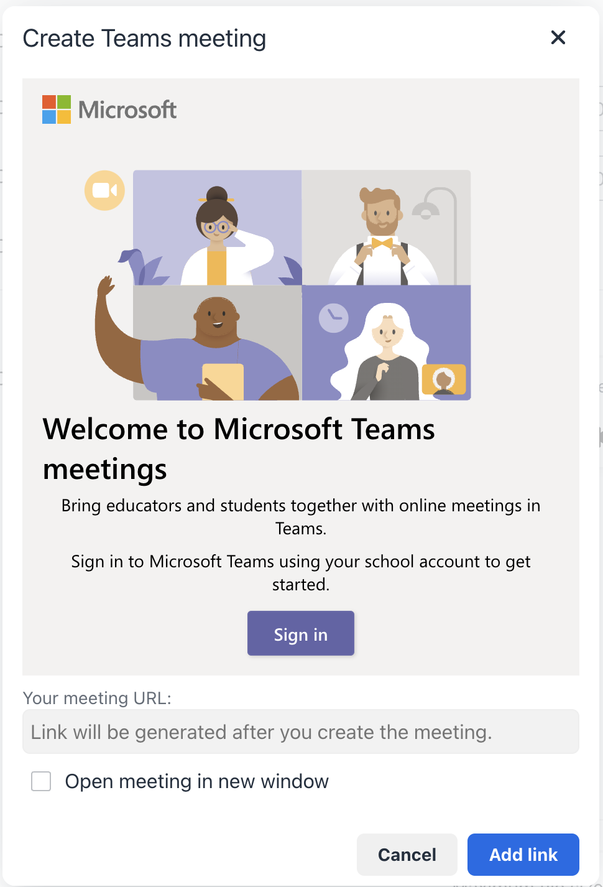
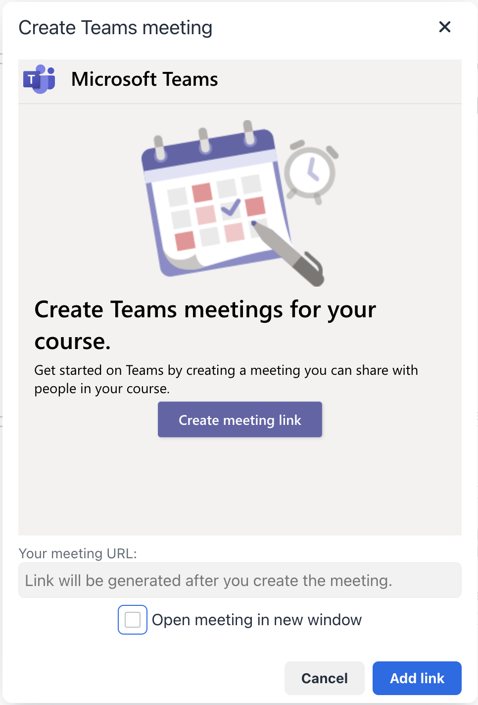
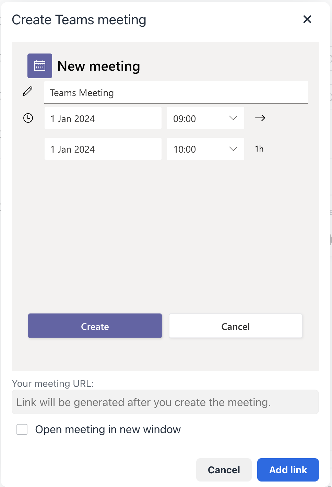
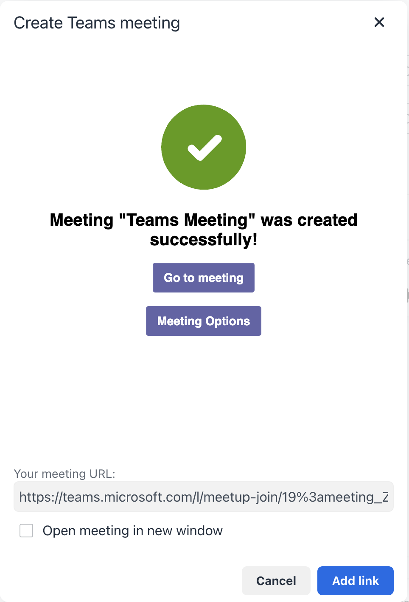
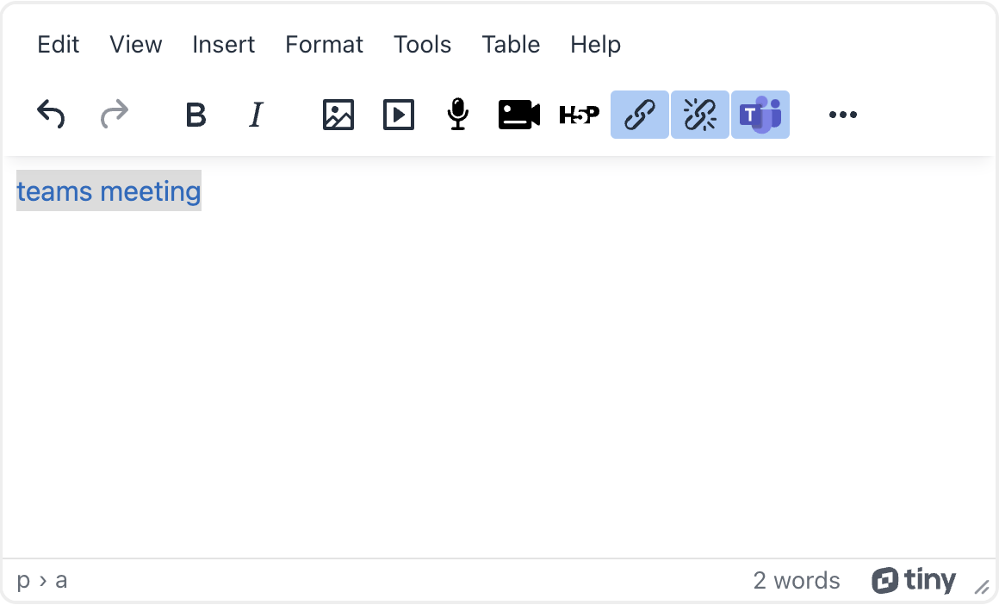

# Moodle Plugins for Microsoft Services
*including* **Microsoft 365** *and other Microsoft services*

## Tiny Editor Teams Meeting Plugin

This plugin integrates the [Microsoft Meetings application](https://github.com/OfficeDev/msteams-app-lms-meetings) into the Moodle Tiny editor, allowing users to create Microsoft Teams meetings and automatically insert the meeting link into editor content.

This is part of the suite of Microsoft 365 plugins for Moodle.

This repository is updated with stable releases. To follow active development, see: https://github.com/Microsoft/o365-moodle

## Installation

1. Unpack the plugin into /lib/editor/tiny/plugins/teamsmeeting within your Moodle install.
2. From the Moodle Administration block, expand Site Administration and click "Notifications".
3. Follow the on-screen instructions to install the plugin.
4. To configure the plugin, go to Site Administration > Plugins > Text editors > Tiny meeting settings.

For more information including support and instructions on how to contribute, please see: https://github.com/Microsoft/o365-moodle/blob/master/README.md

## Usage Guide

1. When editing HTML content using the Tiny editor, type the text you want to use as a meeting link, select it, and click the Microsoft Teams icon in the toolbar.

2. Select **Create meeting link** (you will need to sign in to your Microsoft Teams account the first time you use it).

3. Enter a meeting title, date, and time, then click **Create**.

4. The link will appear in the **Your meeting URL** field. Check **Open in a new window** if you want the meeting to open in a new tab, then click **Add link** to finish.

5. To access meeting options, select the text containing the meeting link and click the Microsoft Teams icon in the Tiny editor toolbar.

6. You will see two buttons — **Go to Meeting** and **Meeting Options**. Click **Meeting Options** to open your meeting options in a new browser window.

## Localization

This plugin passes the user's Moodle language setting to the Meetings App. Supported locales in the Meetings App are: `ar`, `bg`, `cs`, `cy`, `da`, `de`, `en-us`, `en-gb`, `es`, `es-mx`, `fi`, `fr`, `fr-ca`, `he`, `is`, `it`, `ja`, `ko`, `nb`, `nl`, `no`, `nn-no`, `pl`, `pt-br`, `pt-pt`, `ru`, `sv`, `th`, `tr`, `zh-cn`, `zh-tw`.

The plugin itself ships with English (`en`) by default. Additional translations contributed by the Moodle community are available at: https://moodle.org/plugins/translations.php?plugin=tiny_teamsmeeting

You can also add your own translations. See [Translating Moodle plugins](https://docs.moodle.org/dev/Translating_plugins) for details.

## Hosting the Meetings App (Optional)

By default, the plugin uses the Microsoft Meetings application hosted by Enovation at `https://enomsteams.z16.web.core.windows.net`. You can optionally self-host the Meetings App:

1. Download the Meetings App code prepared for use with this plugin from: https://github.com/enovation/msteams-app-lms-meetings
2. Follow the instructions in the repository README to set up and deploy the application.
3. Update the Meetings application URL in the plugin settings at `<moodle_url>/admin/settings.php?section=tiny_teamsmeeting_settings`.

## Issues and Contributing

Please post issues for this plugin to: https://github.com/Microsoft/o365-moodle/issues/

Pull requests for this plugin should be submitted against our main repository: https://github.com/Microsoft/o365-moodle

## Copyright

&copy; Microsoft, Inc.  Code for this plugin is licensed under the GPLv3 license.

Any Microsoft trademarks and logos included in these plugins are property of Microsoft and should not be reused, redistributed, modified, repurposed, or otherwise altered or used outside of this plugin.
