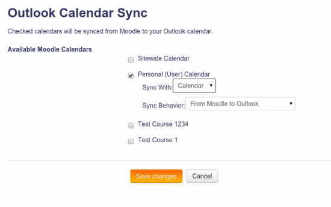

Microsoft block
===============
The Microsoft block provides the ability for users to quickly link off to Office 365 services.
	- Course SharePoint site
	- Course Group
	- My Delve
	- My Docs.com 
	- My OneNote Notebook
	- My OneDrive
	- Settings
		- Outlook Calendar Sync settings
		- Office 365 Connection settings

You can configure which of the following items show up in the plugins using the configuration settings under **Site Administration \> Plugins \> Blocks \> Microsoft**. A few important items to note:
	- All settings besides Course Group and Course SharePoint site are evergreen, meaning they can be accessed at any time from any page on which the Microsoft block has been added to a page in Moodle
	- If enabled, Course SharePoint site and Course Group only appear once the user is inside a Moodle course for which they are enrolled 
	- Course SharePoint site and Course Group cannot be disabled from the Microsoft block. They can only be enabled/disabled from the the Microsoft Office 365 Integration plugin.

Outlook Calendar sync
---------------------

This feature allows users to sync their Moodle calendars with Office 365. Users can have events in their Moodle calendar events appear in any Office 365 calendar, and have events created in Office 365 synced back to Moodle.

To use this feature:

1.  Ensure the Microsoft block has been added to a page in Moodle (for example, the Moodle dashboard).
2.  As a user connected to Office 365, visit a page where the Microsoft block is visible.
3.  Click the "Outlook Calendar Sync settings" link in the Microsoft block.
4.  From here, you should see a list of your available Moodle calendars. Click the checkmark next to the ones you'd like to sync.
    1.  
    2.  By default, the calendars will sync with your Office 365 "primary" calendar typically named "Calendar". You can choose a different calendar to sync with using the "Sync with" select box.
    3.  
5.  You can also choose to sync from Office 365 in to Moodle (or both from Moodle to Office 365 and from Office 365 to Moodle). This is done using the "Sync behavior" select box.
6.  Once you're subscribed to a calendar, wait for the site's cron function to run to sync older calendar events. However, new events should sync right away.