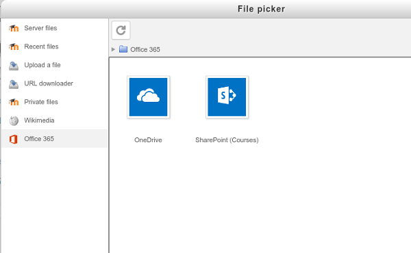
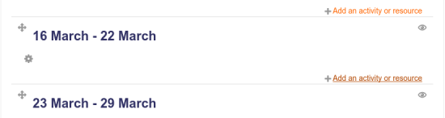
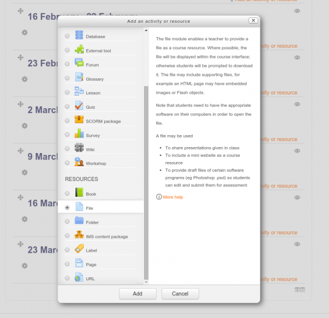
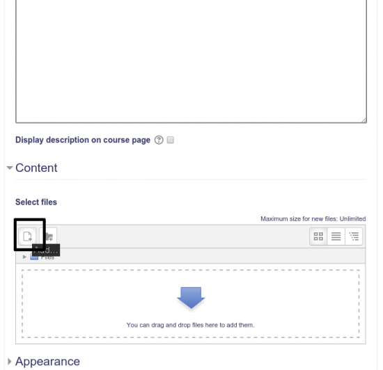
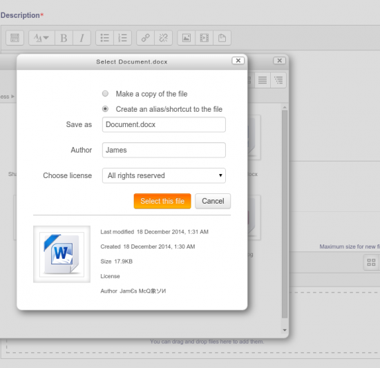
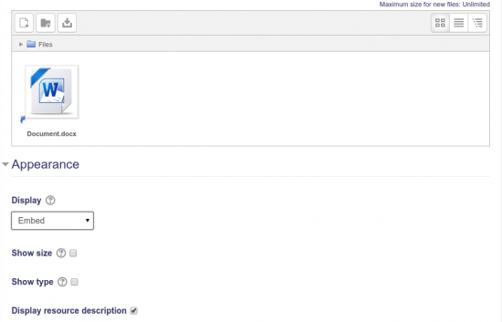
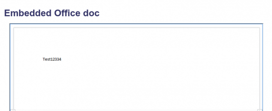

Office 365 Repository
================================

The Office 365 repository allows users using the Office 365 integration plugins to connect to various file stores within Office 365, including their personal OneDrive for Business, as a Moodle repository. You can configure which Office 365 services are available via the Moodle file-picker in the Office 365 repository settings page. Currently the services available are: 

**OneDrive** contains all documents in your personal OneDrive for Business
**SharePoint (Courses)** will list all SharePoint document libraries associated with Moodle Courses that you have access to. 
**Group Files (Courses)** will list all the Office 365 Group File folders associated with Moodle Courses that you have access to. 
   

Downloading and linking files
-----------------------------

1.  When using a file-picker anywhere in Moodle, you'll see a list of repositories on the left side of the popup. Look for and click on "Office 365".
2.  If you are a regular user within Moodle, you will see folders for the services that have been enabled for you. 
3.  You will now see a list of all the files and folders in your OneDrive. If you want to download files from the "SharePoint (Courses)" or "Groups Files(Courses)", you'll click on the respective folder then click the folder for the course you want to access.
4.  Navigate and click the file you want to download into Moodle.
5.  Choose to "Make a copy of the file", or "Create an alias/shortcut to the file."
    1.  If you want to download a copy of the file as it is now, choose "Make a cope of the file". This will copy the file into Moodle, and will then use the local Moodle copy when the file is accessed from within Moodle. Any changes to the file in OneDrive will not be seen in Moodle.
    2.  If you want to link a file choose "Create an alias/shortcut to the file". This will create a link in Moodle to the file in OneDrive, and the file will be accessed from OneDrive directly. Any changes to the file in OneDrive will be seen when accessing the file from Moodle.
6.  You can change other file information like the filename or author name using the respective text fields. This information is only applicable to the Moodle side of the file, and will not transfer to OneDrive.
7.  Click "Select this file".

Uploading files
---------------

You can upload files into Office 365 from the Moodle file-picker interface.

1.  When accessing a Office 365 folder (for example, OneDrive) from a file picker, you will see an "Upload New File" item in the list of files and folders.
2.  Click the "Upload new file" item.
3.  Choose the file you want to upload and click "Upload this file".
4.  The file will be uploaded to OneDrive and selected for the file picker.

Embedding Office documents
--------------------------

This repository allows users to embed Office documents from OneDrive into a course and have the live version viewable using Office web apps.

1.  Start as a user connected to Office 365 and who has access to modify a course.
2.  Turn on editing for the course and choose "Add an activity or resource" for the section of the course you want to add the document.
    1.  

3.  Choose the "File" resource to add to the course.
    1.  

4.  In the "Content" section of the file resource settings page, click the "Add" button in the filepicker
    1.  

5.  Choose the "OneDrive for Business" repository and choose your Office document.
6.  When you select a file, make sure "Create an alias/shortcut to the file" is selected, the click "Select this file"
    1.  

7.  Expand the "Appearance" section, and choose "Embed" for the "Display" select box.
    1.  

8.  Click "Save and display"
9.  You should see the file embedded into the page.
    1.  
