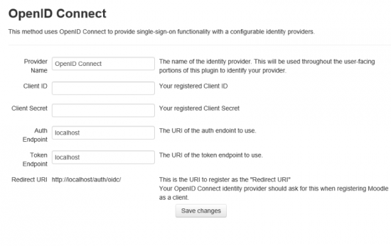

Setup
=====

Server Requirements
-------------------

This plugin suite supports the [minimum system requirements for Moodle 2.7](https://docs.moodle.org/dev/Moodle_2.7_release_notes#Server_requirements).

Client Requirements
-------------------

This plugin suite supports the [minimum client requirements for Moodle 2.7](https://docs.moodle.org/dev/Moodle_2.7_release_notes#Client_requirements)

Installation
------------

The packages are available from:

-   The [Moodle Plugins directory](https://moodle.org/plugins/)
    -   [Office 365 Plugin Set](https://moodle.org/plugins/browse.php?list=set&id=72)
-   GitHub
    -   <https://github.com/Microsoft/moodle-local_office365>
    -   <https://github.com/Microsoft/moodle-auth_oidc>
    -   <https://github.com/Microsoft/moodle-block_microsoft>
    -   <https://github.com/Microsoft/moodle-local_o365>
    -   <https://github.com/Microsoft/moodle-local_onenote>
    -   <https://github.com/Microsoft/moodle-assignfeedback_onenote>
    -   <https://github.com/Microsoft/moodle-assignsubmission_onenote>
    -   <https://github.com/Microsoft/moodle-repository_onenote>
    -   <https://github.com/Microsoft/moodle-repository_office365>
    -   <https://github.com/Microsoft/moodle-filter_oembed>

When you log back in to your Moodle instance, you are presented with the all the plugin configuration options. Save the settings without configuring them for now, you will come back to them later.

For information on installing plugins in Moodle see [Installing plugins](Installing plugins "wikilink")

Configuration
-------------

After you have the plugins installed in your Moodle instance, you'll need to do a bit of setup before you can use and configure additional plugin settings including User Sync, SharePoint, etc. For more information on these additional settings see Microsoft Office 365 Integration Local plugin.

### Enable the OpenID Connect Authentication Plugin

1.  Navigate to **Site Administration \> Plugins \> Authentication** and click **Manage authentication**
2.  Locate the OpenID Connect authentication plugin and click the eye icon to enable
3.  Click the Settings link for the plugin.
4.  Verify the Authorization and Token endpoints. These should be set by default but if not, set the endpoints to the following:
    1.  **Authorization Endpoint:** <https://login.microsoftonline.com/common/oauth2/authorize>
    2.  **Token Endpoint:** <https://login.microsoftonline.com/common/oauth2/token>

5.  Note the Redirect URI. This should be the URI of your Moodle instance followed by /auth/oidc. You will need to enter this value into Azure AD later, so note this value and put it aside.
    1.  For example, <https://www.example.com/auth/oidc/>
    2.  Notes:
        1.  This is a fixed value that is derived from your Moodle site's configured URL (wwwroot). You cannot change this value directly. If you need to change it for any of the following reasons, you must change your Moodle site's configured domain name ($CFG-\>wwwroot).
        2.  This URL must be a fully qualified domain name pointing to your Moodle instance.
        3.  If your Moodle installation is configured with an IP address pointing to your instance, you must change $CFG-\>wwwroot in your config.php to a fully-qualified domain name.
        4.  This domain name does not need to be publicly accessible (i.e. internet-wide), but does need to be accessible to users of your Moodle instance. So, for example, you can use a intranet-only domain name.

### Prepare your Office 365 account for single sign-on with your Moodle installation

You will need an Azure subscription. If you do not have one, you can create one by visiting [http://azure.microsoft.com/en-us/pricing/free-trial/ Microsoft Azure Sign Up](http://azure.microsoft.com/en-us/pricing/free-trial/ Microsoft Azure Sign Up "wikilink")

To use Moodle with Office 365 for SSO, you must [configure Microsoft Azure](https://manage.windowsazure.com) to manage your Office 365 Microsoft Azure Active Directory:

1.  Create a new Active Directory.
2.  Select Use existing directory.

3.  Select **I am ready to be signed out now** and click the check mark.

4.  Sign in with your Office 365 subscription credentials.
5.  Click **Continue**.
6.  Log out and sign back in to your Azure account.

**Note**: In order to sign-up for an Azure subscription, you are required to enter a credit card and phone number. If only use the subscription to access the Azure Active Directory associated with your Office 365 subscription and enable no other paid services such as Virtual Machines, you will not be charged for the subscription.

### Register your Moodle instance as an Application in Azure Active Directory

1.  Sign in to the [Microsoft Azure Management Portal](https://manage.windowsazure.com).
2.  Click on the **Active Directory** icon on the left menu, and then click on the desired Office 365 connected Azure AD.
3.  On the top menu, click **Applications**. If no apps have been added to your directory, this page will only show the **Add an App** link. Click on the link, or alternatively you can click on the **Add** button on the command bar.
4.  On the **What do you want to do** page, click on the link to **Add an application my organization is developing**.
5.  On the **Tell us about your application** page, you must specify a name for your application and indicate the type of application you are registering with Azure AD. Click **web application and/or web API** (default) and then click the arrow icon on the bottom-right corner of the page.
6.  On the App properties page, provide the **Sign-on URL** and **App ID URI** for your Moodle instance.
    1.  The Sign-on URI is the Redirect URI you from the OpenID Connect authentication plugin configuration. **Ensure there is a trailing slash for this URL - i.e. <https://example.com/auth/oidc/>**
    2.  The APP ID URI is the main URI of the Moodle instance.

7.  Click the checkbox in the bottom-right hand corner of the page and then click Ok to add your app to Azure Active Directory.
8.  There are a couple more values and changes you need to make and write down some values which you will need in the next section.

### Configure your Azure Active Directory Application

1.  In Azure, click on the **Active Directory** icon on the left menu, and then click on the desired Azure AD.
2.  Click the Applications tab at the top of the screen.
3.  Locate the application you created and click it's name in the list.
4.  Click Configure at the top of the screen.
5.  Locate the **Client ID**, note this value (write it down or copy it somewhere), and set it aside. You'll need it later.
6.  Create a client secret key.
    1.  Locate the **keys** section of the page.
    2.  Select a duration for the validity of the key.
    3.  Click "Save" at the bottom of the screen. The page will reload and a key value will be shown in the keys section.
    4.  Note this key value (copy it to a file on your computer, for example) and set it aside. You'll need later.
    5.  

7.  Locate the **Permissions to other applications** section.
8.  Click **Add application** click the plus sign to the right of **Microsoft Graph**, **Office 365 Exchange Online**, **Office 365 SharePoint Online**, and **OneNote**. Note, the plus will appear when you hover over each of the items.
9.  Click the check mark at the bottom right of the dialog.
10. In the Delegated Permissions dropdown for Office 365 Exchange Online select the following permissions:
    1.  Read user calendars.
    2.  Read and write user calendars.

11. In the Delegated Permissions dropdown for Office 365 SharePoint Online select the following permissions:
    1.  Read items in all site collections
    2.  Read and write items in all site collections
    3.  Read and write items and lists in all site collections
    4.  Have full control of all site collections
    5.  Read user files
    6.  Read and write user files

12. In the Delegated Permissions dropdown for Windows Azure Active Directory select the following permissions:
    1.  Read and write directory data
        * Note: Write permissions here are used by the Azure AD setup tool to automatically fix permissions. If you do not want to grant directory write access, the plugin suite will work with only the "Read directory data" permission.
    2.  Read all users' full profiles
    3.  Access the directory as the signed-in user.

13. In the Delegated Permissions dropdown for OneNote select the following permissions:
    1.  Create pages in OneNote notebooks
    2.  View OneNote notebooks.
    3.  View and modify OneNote notebooks.

14. In the Delegated Permissions dropdown for Microsoft Graph select the following permissions:
    1. Have full access to user calendars.
    2. Access directory as the signed in user.
    3. Read and write directory data.
    4. Have full access to user files.
    5. Read and write all groups.
    6. Read and write notebooks that the user can access (preview).
    7. Read items in all site collections.
    8. Read and write all users full profiles.
    9. Sign users in.

15. In the Application Permissions dropdown for Windows Azure Active Directory select the following permissions:
    1.  Read directory data

16. In the Application Permissions dropdown for Microsoft Graph select the following permissions:
    1. Read and write files in all site collections.
    2. Read and write all users' full profiles.
    3. Read directory data.
    4. Read and write all groups.
    5. Read and write calendars in all mailboxes.

16. Click save at the bottom of the screen.

### Assign Users to your Azure Active Directory Application

1.  Click on the **Active Directory** icon on the left menu, and then click on the desired Azure AD.
2.  Click the Applications tab at the top of the screen.
3.  Select your app.
4.  Click the Users tab at the top of the screen.
5.  Select an Office 365 User to assign to assign to the App.
6.  Click Assign at the bottom of the screen.
7.  When prompted whether you are sure you want to enable access, click Yes.

The application will appear in the [My apps](https://portal.office.com/myapps) page of the application launcher on the Office 365 portal for the users which have been assigned. Unless "User assignment required to access app" setting is enabled in the application, assignment is not necessary for users to use the Moodle integration.

### Configure the Setup tab in the Microsoft Office 365 Integration plugin

Navigate to **Site Administration \> Plugins \> Local plugins**.  Click **Microsoft Office 365 Integration**.  Under the **Setup** tab, complete each of the following steps:

1.  Register Moodle with Azure AD (process outlined above).
    1.  Copy the client ID and key you noted earlier from Azure AD into the appropriate fields in step 1.
    2.  Click save changes at the bottom of the page.

2.  Set a System API User
    1.  This should report "No user set". Click "Set User"
    2.  You will be taken to an Office 365 login screen. Log in as a user that has administrator access in your Office 365 subscription.
    3.  This user is used for system operations that are not specific to a single user - i.e. user sync operations. This user needs to have administrator access to be able to access all needed information.
    4.  You can change this user later if needed.

3.  Detect additional information and verify your setup.
    1.  Azure AD Tenant.  This is the domain name that identifies your Office 365 subscription, for example "contoso.onmicrosoft.com".  If you know it, enter it in this box, if not, click the "Detect" button to attempt to detect the correct value.
	2.  OneDrive for Business URL.  This is the URL that your users use to access OneDrive for Business. This can usually be determined from your AzureAD tenant, for example, if your tenant is "contoso.onmicrosoft.com", your OneDrive for Business URL is "contoso-my.sharepoint.com.".  If you know the URL, enter it here, otherwise click "Detect" to attempt to detect the correct value.  Only enter the domain name, do not include "<http://>", "www." or any trailing slashes. For example "contoso-my.sharepoint.com", not "<https://contoso-my.sharepoint.com/>"
	3.  Azure Setup.  This tool verifies that Azure has been correctly set up. Click the "Update" button to check setup.  If the tool reports any missing permissions, return to Azure and ensure that all required permissions have been added to your configured application for Moodle.

4. Click Save changes.

Setting up your users.
----------------------

To use any Office 365 features, a Moodle user must be connected to an Office 365 user that has an active Office 365 subscription. The plugin suite provides several different ways to set up user accounts in Moodle to use Office 365 features.

Importing Azure AD users into Moodle
------------------------------------

If you have users in Azure AD that do not already have an account in Moodle, you can import users into Moodle in a few ways. If your Azure AD users already have a separate account in Moodle and you want to link them, see the next section.

### User sync.
User sync will sync the Moodle user list with Azure AD and can perform various different operations on the Moodle user list depending on a few settings you can select. This method is useful if you want to create users in Moodle that match your users in Azure AD, and have user accounts created ahead of user access. If you would like to populate your Moodle site with users from Azure AD and be able to enrol the users in various courses before users start using Moodle, this is the best solution. See the full documentation on [user sync](local_o365.md) for more information on how to use this feature.

### On-demand user creation.
The OpenID Connect authentication plugin will create a Moodle user from an Azure AD user that tries to log in to Moodle using Azure AD, successfully authenticates, and does not have an existing linked Moodle account. The Moodle user will be created on the fly as the user logs in. This is useful for a more on-demand Moodle setup where users do not need to be created and pre-enroled ahead of time, but instead allow users to self-select their courses. You can disable this function by going to the common Moodle authentication settings (Site Administration > Plugins > Authentication > Manage authentication), and checking the "Prevent account creation when authenticating" setting.

Connecting existing Moodle users to Office 365
----------------------------------------------

There are four ways to connect existing Moodle users to Office 365 users. Two admin-driven methods, and two end-user-driven methods. The admin methods require a Moodle administrator to configure a setting or run a tool, and the end-user methods require the Moodle user you want to link to perform some operation.

### Admin: Using user sync auto-matching.

If your existing Moodle users have the same usernames as your users in Azure AD, the user sync process can match users automatically. This process will match, case-insensitively, the beginning part of the Azure AD username (before the "@") against any Moodle user with the same username and can link the users either by switching the Moodle user's authentication method to OpenID Connect, or link the Moodle user in the background - leaving the Moodle authentication method unchanged. Please see the [user sync documentation](local_o365.md) for more information about user sync.

### Admin: User matching tool

If your users in Moodle have different usernames from the users in Azure AD, there is a user matching tool that will allow you to upload a CSV file containing a list of Moodle usernames and their corresponding Azure AD usernames.

To access this tool, go to the integration local plugin settings page (Site administration > Plugins > Local plugins > Microsoft Office 365 Integration), and click the "Tools" tab, then the "User Matching" link. This page provides a description of the CSV format, and a file picker to upload the file.

To run the user matching tool:
1.  Upload a CSV, matching the displayed format, using the file picker on this page.
2.  Click the "Add Data File to Match Queue" button.
3.  The CSV will be processed and you will see a list of usernames in "Step 2". This is the processing queue.
4.  Every time your Moodle cron runs, a batch of users in the queue will be processed. The results will be shown in the queue.

### End User: Migrate the user to using their Office 365 credentials to log in to Moodle.

With this method, the user will log in to Moodle using their Office 365 account credentials.

- Users who do not yet have a Moodle account can simply follow the normal OpenID Connect login process (see: [OpenID Connect Authentication Usage](#openid-connect-authentication-plugin). If a Moodle account is not found for a user logging in with OpenID Connect, an account will be created for them.
- You can migrate existing Moodle users to Azure AD login by following the steps below:
  1. Ensure the user you want to migrate has the "auth/oidc:manageconnection" or "auth/oidc:manageconnectionconnect" capability. Regular users do not have this capability by default.
    * The "auth/oidc:manageconnectionconnect" capability will allow users to link an account, while the "auth/oidc:manageconnectiondisconnect" capability will allow them to unlink. It is therefore possible to give users the capability to link, but not unlink.
  2. Ensure the Microsoft block has been added to a page in Moodle (for example, the Moodle dashboard).
  3. Log in as the user to be migrated, visit a page that has the Microsoft block visible.
  4. Click the **Connect to Office 365** link in the Microsoft block.
  5. You will be brought to the **Office 365 / Moodle Control Panel**.
  6. Click the *Office 365 Connection* link under **Office 365 Features**
  7. Click the "Start using Office 365 to log in to Moodle." link.
  8. You will be redirected to Office 365 to log in. Log in to the Office 365 account you'd like to link the Moodle user to.
    1.  **NOTE:** If you are already logged in to Office 365, you will not have to enter your credentials on the Office 365 login page - the account you are logged in to will be linked to the Moodle account. Ensure you are logged in to the correct account, use a private browser window, or log out of Office 365 first to show the Office 365 login screen.
  9. You will be redirected back to Moodle to the Office 365 / Moodle control panel. The **Connection status** box on the side of the page should indicate that you are connected to Office 365 and that you are using Office 365 to log in to Moodle.
  10. The Moodle account will now use Office 365 to log in. **The previous Moodle login method will not work.**.
  11. The Moodle user can now use any of the Office 365 features in Moodle.

### End user: Link a Moodle user to an Office 365 user.

This will allow you to connect a user to Office 365, enable all Office 365 features with this user, but not have to change their Moodle login method.

1. Ensure the Microsoft block has been added to a page in Moodle (for example, the Moodle dashboard).
2. Ensure the user you want to migrate has the "local/o365:manageconnectionlink" capability. Regular users do not have this capability by default.
    * The "local/o365:manageconnectionlink" capability will allow users to link an account, while the "local/o365:manageconnectionunlink" capability will allow them to unlink. It is therefore possible to give users the capability to link, but not unlink.
3. Log in as the user to be migrated, visit a page that has the Microsoft block visible.
4. Click the **Connect to Office 365** link in the Microsoft block.
5. You will be brought to the **Office 365 / Moodle Control Panel**.
6. Click the *Office 365 Connection* link under **Office 365 Features**
7. Click the link that says **Link your Moodle account to an Office 365 account.**
8. You will be redirected to Office 365 to log in. Log in to the Office 365 account you'd like to link the Moodle user to.
  1.  **NOTE:** If you are already logged in to Office 365, you will not have to enter your credentials on the Office 365 login page - the account you are logged in to will be linked to the Moodle account. Ensure you are logged in to the correct account, use a private browser window, or log out of Office 365 first to show the Office 365 login screen.
9. You will be redirected back to Moodle to the Office 365 / Moodle control panel. The **Connection status** box on the side of the page should indicate that you are connected to Office 365 and that you are linked to an Office 365 account.
10. The Moodle account is now linked to the Office 365 account and can use Office 365 features as that user.
11. The Moodle user's login method will not change, the user will log in to Moodle as they always have.
12. If the user experiences any problems using Office 365 features, it's possible the token generated during this initial linking process has expired. Return to the **Office 365 / Moodle Control Panel** and click the **Refresh Connection** link in the Connection Status box. This will generate a new token.
